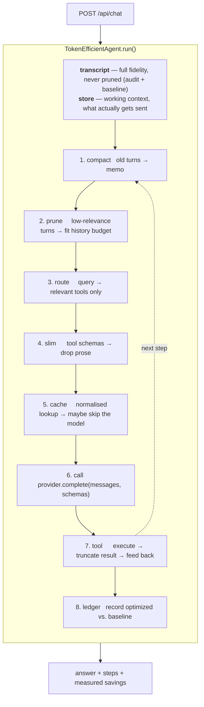

# tokenmax — an agentic reference project built around token efficiency

A small, complete, runnable demo of how to design and build an agentic
application where **token cost is a first-class architectural concern** rather
than an afterthought.

It runs fully offline with a deterministic mock model, so a client demo never
depends on an API key, a rate limit, or a lucky generation.

```
naive                 :   14284 tokens
optimized (cold)      :    7774 tokens   (45.6% saved)
optimized (warm cache):       0 tokens   (100% saved)

naive        peak prompt   1703 / 1200 -> OVERFLOWS - request would be rejected
optimized    peak prompt    886 / 1200 -> fits
```

---

## Why this exists

Most agent demos show that a model *can* answer. This one shows what it *costs*
to answer, and it proves the saving with a measured counterfactual instead of a
claim. Every model call is recorded twice:

- **optimized** — what the agent actually sent
- **baseline** — what a naive agent would have sent (full transcript, every tool
  schema in full, no cache)

The difference is the demo.

---

## Quick start

```powershell
python -m venv .venv
.\.venv\Scripts\python.exe -m pip install -e ".[dev]"

.\.venv\Scripts\python.exe demo\run_demo.py                          # console walkthrough
.\.venv\Scripts\python.exe -m pytest -q                              # 51 tests
.\.venv\Scripts\python.exe -m uvicorn tokenmax.api.main:app --reload # http://127.0.0.1:8000
```

Open <http://127.0.0.1:8000> for the console UI: an A/B scenario runner, a live
chat box with per-turn token accounting, and the active technique list.

Nothing above needs credentials. To point at a real model:

```powershell
copy .env.example .env    # then set TOKENMAX_PROVIDER=openai and TOKENMAX_API_KEY
```

---

## The six techniques

| Technique | What it does | Where |
|---|---|---|
| **Compaction** | Replaces old turns with one dense memo before they are resent | `context/compaction.py` |
| **Pruning** | Drops low-relevance history to fit the history budget | `context/pruning.py` |
| **Tool routing** | Exposes only query-relevant tool schemas | `tools/registry.py` |
| **Schema slimming** | Strips prose descriptions from tool schemas | `tools/registry.py` |
| **Result truncation** | Trims oversized tool output middle-out | `tokens.py` |
| **Prompt cache** | Normalised exact-match cache, returns prior completions | `cache/prompt_cache.py` |

Measured independently by `demo/run_demo.py` (ablation, one technique at a time):

| Technique | Saved | Share |
|---|---|---|
| pruning | 4277 | 29.9% |
| tool routing | 2688 | 18.8% |
| result truncation | 1561 | 10.9% |
| schema slimming | 948 | 6.6% |
| compaction | 812 | 5.7% |
| cache | — | pays off on the warm run (100%) |

Every technique is a runtime flag (`TOKENMAX_ENABLE_*`), so you can switch one
off mid-demo and re-run to show its individual cost.

---

## Architecture in one picture



The single most important design decision: **the stored transcript and the sent
prompt are different objects.** Compaction and pruning are lossy operations on a
*derived view*, so they can be aggressive without ever destroying user data.

Full diagram set — system context, components, sequence, budget arithmetic,
pruning tiers, cache, ledger, data model — in
[docs/DIAGRAMS.md](docs/DIAGRAMS.md).

---

## Documentation

| Document | For |
|---|---|
| [docs/ARCHITECTURE.md](docs/ARCHITECTURE.md) | Design rationale and the client walkthrough script |
| [docs/DIAGRAMS.md](docs/DIAGRAMS.md) | Thirteen diagrams covering every subsystem |
| [docs/MODULES.md](docs/MODULES.md) | File-by-file code map |
| [docs/API.md](docs/API.md) | HTTP reference with request/response shapes |
| [docs/CONFIGURATION.md](docs/CONFIGURATION.md) | Every `TOKENMAX_*` setting and how to tune it |


---

## Project layout

```
src/tokenmax/
  agent/loop.py          the pipeline — read this first
  context/               budget, store, pruning, compaction
  cache/                 normalised prompt cache + stats
  tools/                 registry with routing & schema slimming, builtin tools
  telemetry/ledger.py    optimized vs. baseline accounting
  providers/             mock (offline, deterministic) + OpenAI-compatible
  tokens.py              counting & middle-out truncation
  api/                   FastAPI routes + console dashboard
demo/run_demo.py         console walkthrough with ablation
docs/                    architecture, diagrams, module map, API, config
tests/                   51 tests, no network
```

## API

| Method | Path | Purpose |
|---|---|---|
| GET | `/api/health` | provider, model, token backend |
| GET | `/api/techniques` | active techniques and budget knobs |
| POST | `/api/chat` | run a turn; returns answer, steps, savings |
| POST | `/api/compare` | replay a scenario naive vs. optimized |
| GET | `/api/sessions/{id}/report` | ledger report with attribution |
| GET | `/api/sessions/{id}/transcript` | full transcript vs. working context |
| GET | `/api/sessions` | sessions + cross-session totals |
| DELETE | `/api/sessions/{id}` | drop a session |

Request and response shapes in [docs/API.md](docs/API.md).

## Notes on honesty

- Token counts use `tiktoken` when installed (`pip install -e ".[tiktoken]"`)
  and a deterministic heuristic otherwise. Relative savings hold either way;
  `GET /api/health` reports which backend is live.
- The mock provider reproduces tool selection, grounded answers and usage
  accounting — not model quality. Swap in `OpenAIProvider` for quality claims.
- Pruning often reports `0` in the combined run because compaction already keeps
  the prompt under budget. That is correct behaviour, not a bug: pruning is the
  hard backstop. Its standalone value is in the ablation table.
