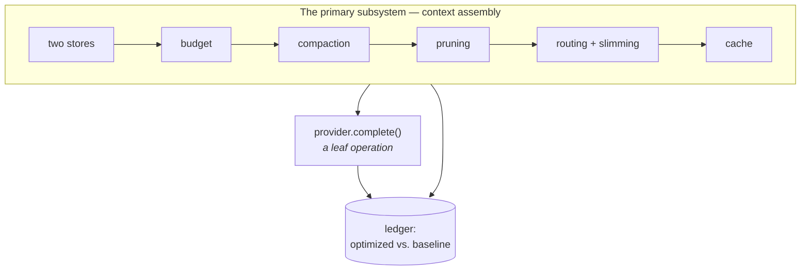
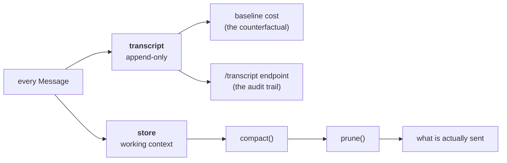
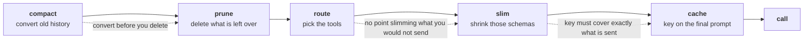
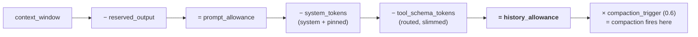
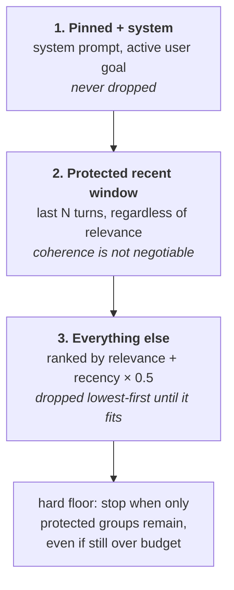

# Architecture & design rationale

This document is written for two audiences: engineers who will copy the pattern,
and clients who want to understand why the pattern is shaped this way.

It explains *why*. For the full diagram set see [DIAGRAMS.md](DIAGRAMS.md), for
the file-by-file map see [MODULES.md](MODULES.md), for endpoints see
[API.md](API.md), and for every knob see [CONFIGURATION.md](CONFIGURATION.md).

---

## 1. The core idea

An agent's cost is not dominated by what the model *writes*. It is dominated by
what you *send*, on every step, of every turn. A 12-tool agent with a 20-turn
conversation re-sends its entire history and its entire tool catalogue on each
step. The cost curve is quadratic in conversation length, and nobody notices
until the invoice arrives.

So the architecture treats **context assembly as the primary subsystem** and the
model call as a leaf operation.



---

## 2. Two stores, not one

```python
self.transcript = ConversationStore()  # full fidelity, append-only
self.store      = ConversationStore()  # working context, aggressively reduced
```

This is the decision everything else depends on.

- `transcript` is the audit log and the baseline yardstick. Nothing is ever
  removed from it.
- `store` is what gets assembled into a prompt. Compaction rewrites it, pruning
  filters it.

Because the two are separate, lossy optimisation is *safe*. You can compact a
40-turn conversation into a memo and still answer "what exactly did the user say
in turn 3?" from the transcript. Systems that optimise a single store in place
cannot do this, and that is why their teams are afraid to turn optimisation on.



---

## 3. The pipeline order matters

`compact → prune → route → slim → cache → call`



- **Compaction before pruning.** Compaction converts old history into a cheaper
  representation. Pruning deletes. Always try to convert before you delete —
  otherwise you throw away facts you could have kept for 40 tokens.
- **Routing before slimming.** No point slimming a schema you were not going to
  send.
- **Cache last.** The cache key must be computed over the *final* assembled
  prompt. Caching before assembly would key on something that is not what you
  send, producing false hits.

---

## 4. Budget arithmetic

`context/budget.py` resolves one number per call:

```
prompt_allowance  = context_window - reserved_output
history_allowance = prompt_allowance - system_tokens - tool_schema_tokens
```



`history_allowance` is the only budget that pruning is allowed to spend. Fixed
costs (the system prompt, the tool schemas, the reserved output) are subtracted
first, so the agent can never be surprised by an overflow it caused itself.

`compaction_trigger` (default `0.6`) fires compaction at a fraction of the
history allowance, well before the hard limit. Compaction is a background-ish
cost; you want it to happen early and cheaply, not in a panic at 99%.

---

## 5. Pruning: what gets kept

Retention is tiered, in this order:

1. **Pinned + system.** The system prompt and the active user goal. Never dropped.
2. **The protected recent window.** The last N turns, regardless of relevance —
   conversational coherence is not negotiable.
3. **Everything else**, ranked by `relevance(query) + recency * 0.5`.



Relevance is deliberately a cheap lexical overlap, not an embedding call.
Spending a model call to decide what to drop from a model call is a trap; the
lexical signal recovers most of the value at zero marginal cost. Upgrade to
embeddings only when you have measured that you need to.

**Tool-call atomicity.** Providers reject a `tool` message whose originating
`assistant` tool call is missing. `_groups()` binds each call to its result so
pruning can never produce an invalid transcript. This is the single most common
bug in hand-rolled pruning implementations.

**The protected window is a hard floor.** Pruning stops when only protected
groups remain, even if the result still exceeds the budget — coherence wins over
cost. That means `protected_recent_turns` must be sized to leave headroom under
the context window; if it does not, no amount of pruning will save you. This is
visible in the ledger's `peak_optimized_prompt`, which is the number to watch
when tuning, not the average.

---

## 6. Tool routing: the silent leak

Every tool schema is sent on every step. With 12 tools at ~120 tokens each,
that is ~1,440 tokens per step — often larger than the conversation itself, and
completely invisible because nobody prints their tool payload.

`ToolRegistry.route()` scores tools by keyword overlap with the query and sends
the top matches. **When no tool scores, it falls back to the full set**: recall
is never traded for savings. A router that silently hides the one tool the agent
needed is worse than no router.

`schema(compact=True)` then drops prose descriptions while keeping names, types
and required flags — the parts the model actually needs to emit a valid call.

---

## 7. Truncation is middle-out

`TokenCounter.truncate_to_tokens` keeps the head and the tail of an oversized
tool result and marks the gap. Identifiers and headers live at the start;
conclusions, totals and error messages live at the end. Naive head-only
truncation reliably removes the answer.

---

## 8. Caching

The cache key is a SHA-256 over the normalised (lowercased, whitespace-collapsed)
assembled prompt plus the tool schemas, with `\x1f` field separators so
`["ab","c"]` and `["a","bc"]` cannot collide.

Normalisation is where the real hit rate comes from: "What is your pricing?" and
"what is YOUR   pricing" are one entry. In support and FAQ workloads this alone
moves hit rates from near-zero to double digits.

A cache hit costs **zero** tokens, so it is recorded as `optimized_total = 0`
against a full baseline — which is exactly why the warm run in the demo reports
100% savings.

---

## 9. The ledger: why this is provable

`telemetry/ledger.py` writes a `CallRecord` for every model call containing both
the optimized and the baseline cost, plus per-technique attribution.

Without a measured counterfactual, "we reduced tokens by 45%" is unfalsifiable.
With one, the claim is a query:

```
GET /api/sessions/{id}/report
```

The report also tracks **peak prompt size**, not just totals. Averages hide the
failure that matters: a single turn that exceeds the context window is a hard
error, not an expensive success. In the demo the naive agent peaks at 1,703
tokens against a 1,200-token window — it does not merely cost more, it breaks.

---

## 10. Provider abstraction

`LLMProvider` exposes exactly two methods, `complete` and `summarize`. The
surface is intentionally tiny: the agent owns context assembly, so no provider
SDK's convenience layer can silently re-inflate the prompt behind your back.

`MockProvider` is deterministic and offline. This is a demo requirement, not a
testing shortcut — a client demo must not be able to fail because of a network
blip, and the token numbers must be identical every time you present them.

---

## Suggested client walkthrough (10 minutes)

1. **Open the console** at `/`. Show the technique list — six named, switchable
   levers, not a black box.
2. **Run the A/B scenario.** One button, two agents, same questions. Read the
   headline percentage and the attribution table.
3. **Point at the overflow line.** "The naive version does not just cost more.
   At turn five it stops working."
4. **Send a live chat message**, then send the same message again. Watch the
   second one cost zero.
5. **Open `/api/sessions/{id}/transcript`.** Show full transcript vs. working
   context side by side: "we did not lose anything, we just stopped paying for
   it."
6. **Run `demo/run_demo.py`** for the ablation table if the audience is technical.
7. **Close on the ledger:** "every number you just saw is recorded per call and
   queryable. This is measurable, not aspirational."
