# Architecture diagrams

Every diagram on this page is generated from the code in `src/tokenmax/`. If a
diagram and the code disagree, the code is right — please open a fix.

Diagrams are Mermaid. GitHub, VS Code and most static-site generators render
them natively; no build step is required.

---

## 1. System context

Who talks to what. The demo is a single process with no external dependency in
its default configuration — that is deliberate, so a client demo cannot fail
because of a network blip.

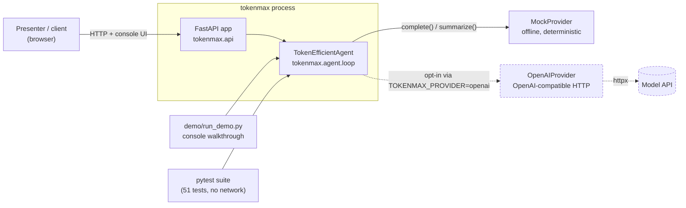

---

## 2. Component map

The package boundaries, and which component owns which concern.

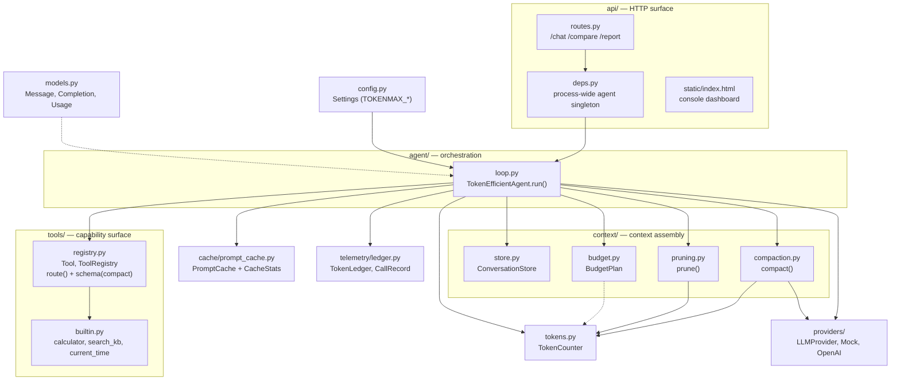

---

## 3. The pipeline

`compact → prune → route → slim → cache → call`. This ordering is load-bearing;
see [ARCHITECTURE.md §3](ARCHITECTURE.md#3-the-pipeline-order-matters) for why.

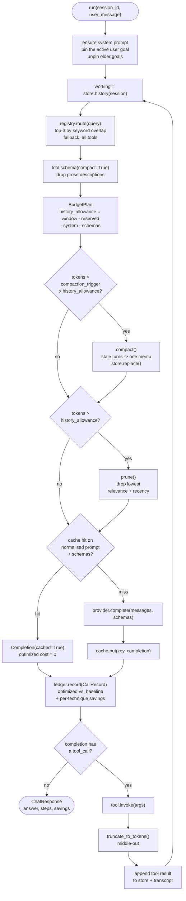

The loop is bounded by `max_steps` (default 6). Exhausting it returns an
explicit "step budget exhausted" answer rather than silently looping.

---

## 4. Two stores, one prompt

The single most important design decision: what is **kept** and what is **sent**
are different objects.

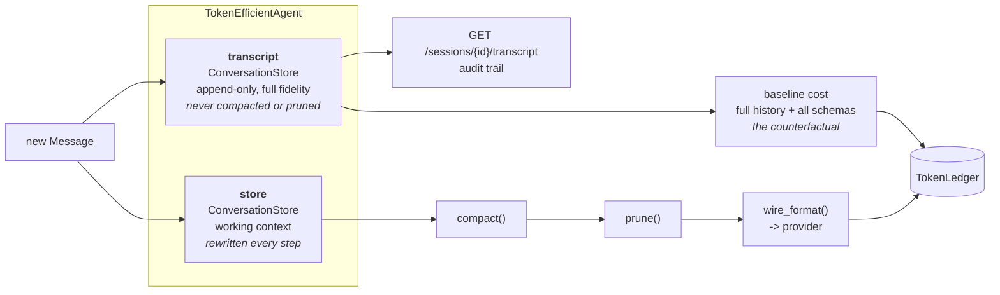

Because the two are separate, lossy optimisation is safe: you can compact forty
turns into a memo and still answer "what exactly did the user say in turn 3?".

---

## 5. Turn sequence

One `POST /api/chat` that needs a tool, end to end.

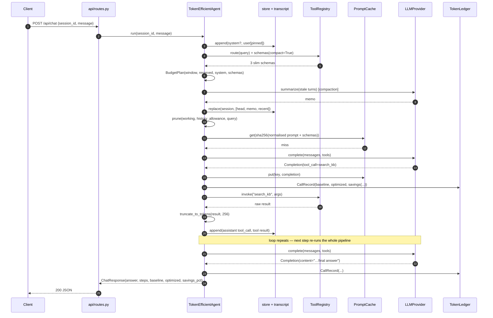

---

## 6. Budget arithmetic

`context/budget.py` resolves one number per call. Fixed costs are paid first, so
the agent can never be surprised by an overflow it caused itself.

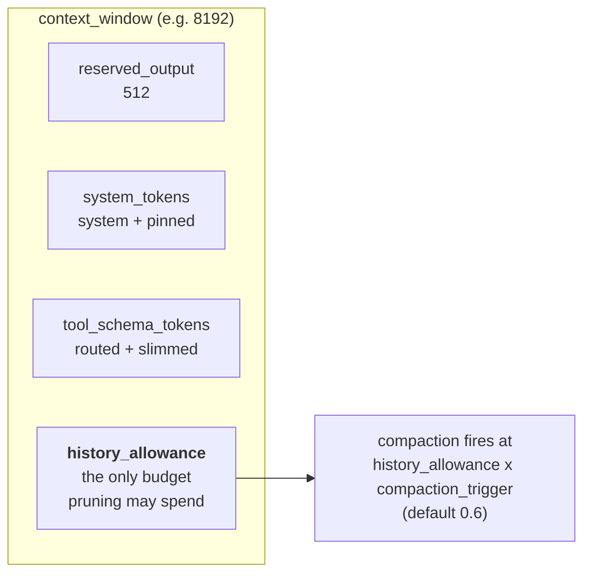

```
prompt_allowance  = context_window   - reserved_output
history_allowance = prompt_allowance - system_tokens - tool_schema_tokens
compaction_threshold = history_allowance * compaction_trigger
```

---

## 7. Pruning: retention tiers

Retention is tiered. Tool calls and their results are bound into one atomic
group first, because providers reject an orphaned `tool` message.

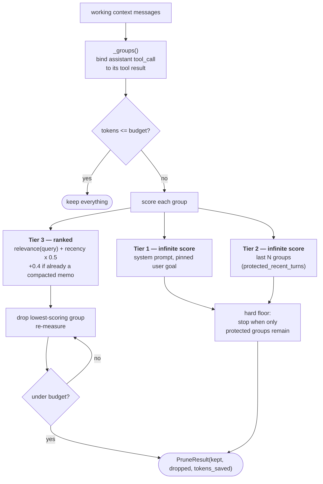

Relevance is a cheap lexical overlap (`|A ∩ B| / sqrt(|A| + |B|)`), not an
embedding call — spending a model call to decide what to drop from a model call
is a trap.

**The protected window is a hard floor.** If it alone exceeds the budget,
pruning stops anyway: coherence wins over cost. Size `protected_recent_turns` to
leave headroom, and watch `peak_optimized_prompt` when tuning.

---

## 8. Tool routing and schema slimming

Two savings, stacked. Routing decides *which* schemas are sent; slimming decides
*how big* each one is.

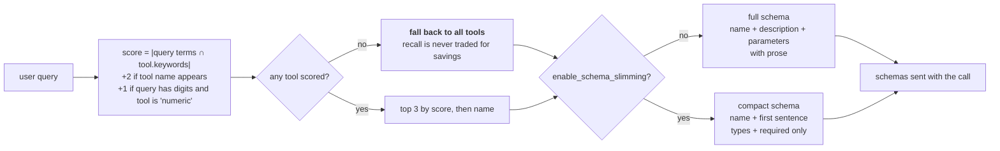

Attribution is measured, not assumed:

```
tool_routing    = tokens(all tools, full)    - tokens(routed tools, full)
schema_slimming = tokens(routed tools, full) - tokens(routed tools, as sent)
```

---

## 9. Prompt cache

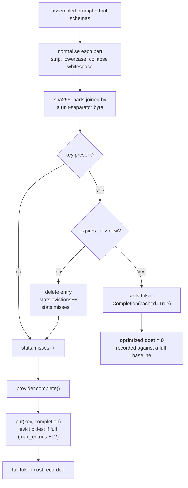

The unit-separator between parts matters: without it `["ab","c"]` and `["a","bc"]` hash
identically, and the cache returns a completion for a prompt that was never
sent. Normalisation is where the real hit rate comes from — "What is your
pricing?" and "what is YOUR   pricing" become one entry.

---

## 10. The ledger: how a saving is proved

Every model call writes one `CallRecord` holding both costs.

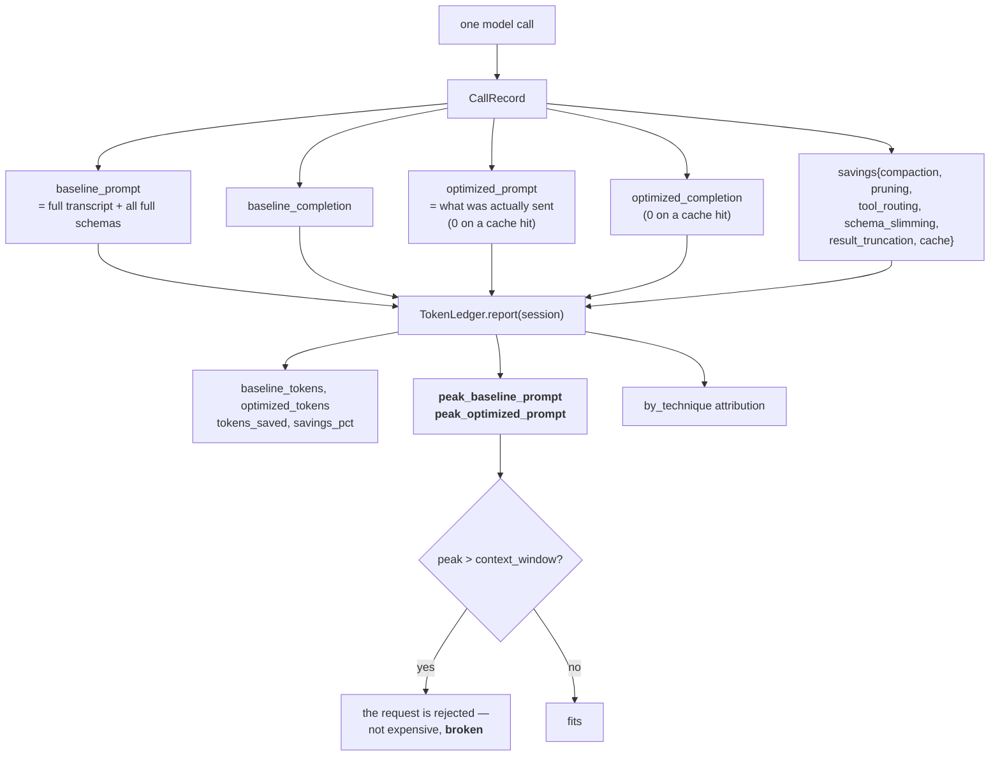

Averages hide the failure that matters. In the demo the naive agent peaks at
1,703 tokens against a 1,200-token window: it does not merely cost more, it
stops working.

---

## 11. Data model

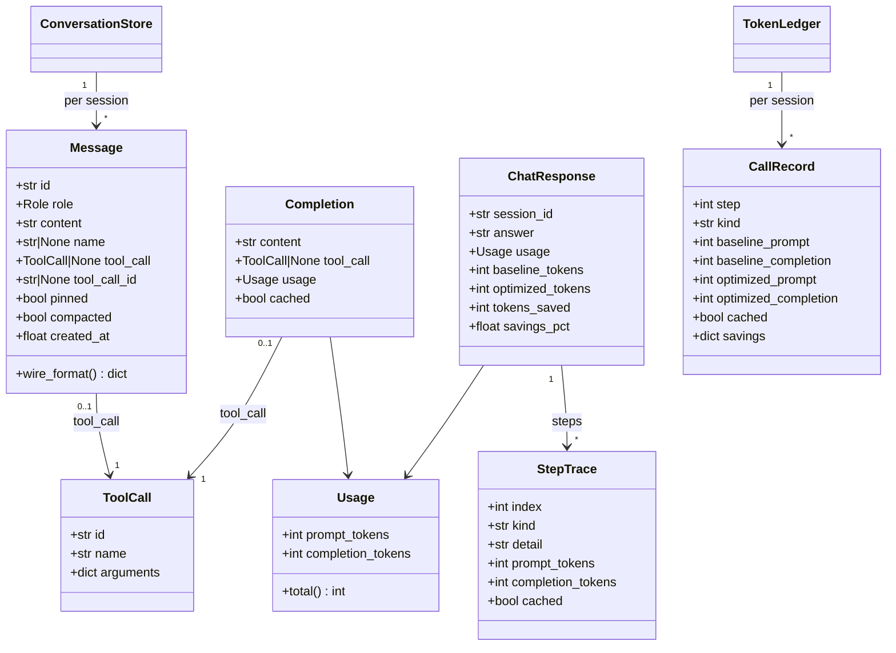

`pinned` and `compacted` are local bookkeeping only — `wire_format()` never
sends them to a provider.

---

## 12. A/B comparison

`POST /api/compare` builds two fully isolated agents from the same `Settings`
and replays one scenario against both.

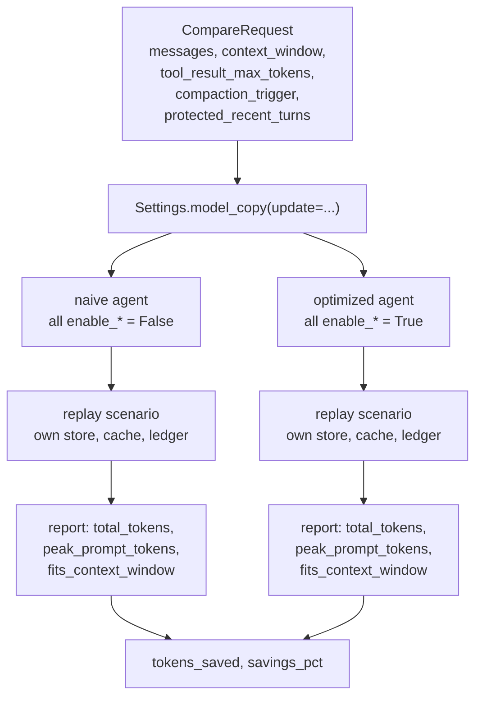

`demo/run_demo.py` extends this into a full **ablation**: it replays the
scenario once per technique with only that flag on, so each technique's
standalone contribution is measured rather than asserted.

---

## 13. Where the tokens actually go

A rough map of one naive step versus one optimized step, using the demo profile
(1,200-token window, three tools).

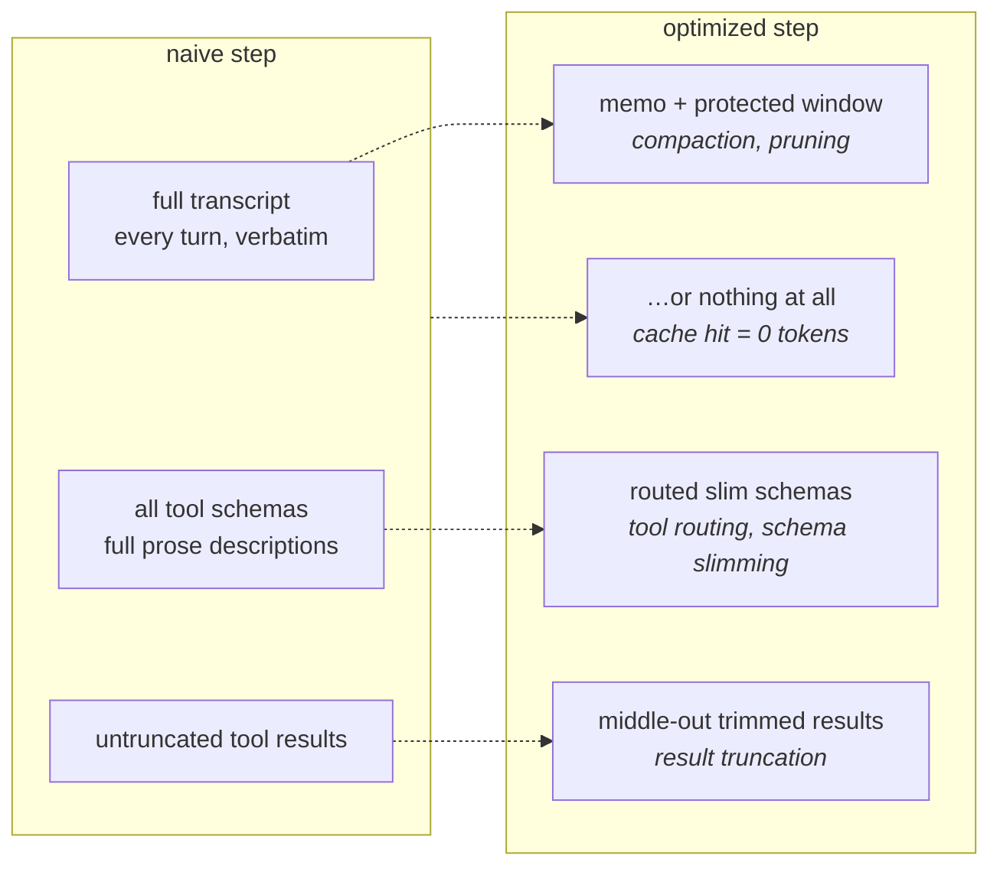

Ablation on the reference scenario (see the README for the current table):
pruning and tool routing dominate, result truncation is third, and the cache
contributes nothing on a cold run and everything on a warm one.
