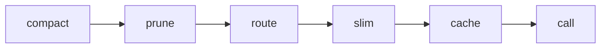

# tokenmax documentation

A reference agentic application where **token cost is a first-class
architectural concern**. Start with the README at the repo root for the
five-minute version; these documents are the detail behind it.

## Read in this order

| # | Document | For |
|---|---|---|
| 1 | [ARCHITECTURE.md](ARCHITECTURE.md) | Why the system is shaped this way. Design rationale, the ten decisions that matter, and the client walkthrough script. |
| 2 | [DIAGRAMS.md](DIAGRAMS.md) | Thirteen Mermaid diagrams: context, components, pipeline, sequence, budget, pruning tiers, routing, cache, ledger, data model. |
| 3 | [MODULES.md](MODULES.md) | Module-by-module code map. What each file owns and the decision it encodes. |
| 4 | [API.md](API.md) | HTTP reference for all eight endpoints, with request/response shapes. |
| 5 | [CONFIGURATION.md](CONFIGURATION.md) | Every `TOKENMAX_*` setting, what it does, and how to tune it. |

## The shortest possible summary

An agent's cost is dominated not by what the model *writes* but by what you
*send*, on every step, of every turn. So this codebase treats **context
assembly as the primary subsystem** and the model call as a leaf operation.

Six techniques, each an independent runtime flag:

| Technique | What it does |
|---|---|
| Compaction | Replaces old turns with one dense memo before they are resent |
| Pruning | Drops low-relevance history to fit the history budget |
| Tool routing | Exposes only query-relevant tool schemas |
| Schema slimming | Strips prose descriptions from tool schemas |
| Result truncation | Trims oversized tool output middle-out |
| Prompt cache | Normalised exact-match cache; a hit costs zero tokens |

One pipeline, and the order is load-bearing:



One design decision everything else depends on: **the stored transcript and the
sent prompt are different objects.** Compaction and pruning are lossy operations
on a derived view, so they can be aggressive without ever destroying user data.

One discipline that makes the claim falsifiable: every model call is recorded
**twice** — what the agent actually sent, and what a naive agent would have sent.
The difference is the demo.

## Where things live

```
docs/            you are here
src/tokenmax/    the library
demo/run_demo.py console walkthrough with per-technique ablation
tests/           51 tests, no network
```
